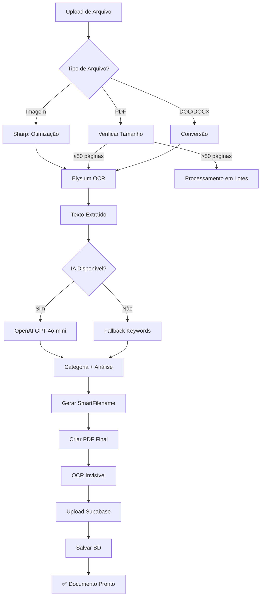

# 📚 Sistema Organizador Jurídico - Documentação Completa

> Sistema completo de gestão e processamento inteligente de documentos jurídicos com IA

**Versão:** 1.0.0
**Data:** Janeiro 2025
**Stack:** Next.js 15, TypeScript, Prisma, Supabase, OpenAI

---

## 📋 Índice

1. [Visão Geral](#visão-geral)
2. [Funcionalidades Principais](#funcionalidades-principais)
3. [Arquitetura Técnica](#arquitetura-técnica)
4. [Fluxo de Processamento](#fluxo-de-processamento)
5. [APIs e Endpoints](#apis-e-endpoints)
6. [Integrações Externas](#integrações-externas)
7. [Custos e Tracking](#custos-e-tracking)
8. [Guia de Uso](#guia-de-uso)
9. [Configuração](#configuração)

---

## 🎯 Visão Geral

Sistema SaaS para organização automática de documentos jurídicos que combina:
- **OCR Avançado** (Elysium) para extração de texto
- **IA (OpenAI GPT-4o-mini)** para categorização e análise
- **Processamento Inteligente** com fallback por palavras-chave
- **Validação de Relevância** baseada em narrativa fática
- **Exportação Profissional** em PDF e ZIP organizados

### Principais Diferenciais:
✅ **Categorização automática** com IA
✅ **Renomeação inteligente** de arquivos
✅ **Validação de relevância** por narrativa
✅ **Exportação organizada** por categorias
✅ **OCR pesquisável** embutido nos PDFs
✅ **Tracking de custos** OpenAI em tempo real
✅ **Rotação manual** de documentos com preview

---

## 🚀 Funcionalidades Principais

### 1. Upload e Conversão Inteligente

#### Tipos de Arquivo Suportados:
- **Documentos**: PDF, DOC, DOCX, TXT
- **Imagens**: JPG, JPEG, PNG, GIF
- **Limite**: 30MB por arquivo

#### Processamento Automático:
1. **Upload** → Validação de tipo e tamanho
2. **OCR Elysium** → Extração de texto (imagens e PDFs)
3. **Processamento em Lotes** → PDFs grandes divididos automaticamente
4. **Correção de Orientação** → Manual via interface
5. **Conversão para PDF** → Todos os formatos viram PDF/A

#### Funcionalidades de Conversão:
- ✅ Conversão de imagens para PDF
- ✅ Conversão de DOC/DOCX para PDF
- ✅ OCR em documentos escaneados
- ✅ Processamento em lotes para PDFs >50 páginas
- ✅ Otimização de tamanho (compressão inteligente)
- ✅ Camada de texto OCR invisível (PDF pesquisável)

---

### 2. Categorização Inteligente com IA

#### Sistema Dual de Categorização:

##### 🤖 **Método 1: IA (OpenAI GPT-4o-mini)**
- **Custo**: ~R$ 0,01 por documento
- **Precisão**: ~90-95%
- **Tempo**: 2-5 segundos

**Processo:**
```
Texto OCR → OpenAI GPT-4o-mini → Análise de Conteúdo → Categorização
```

**Categorias Identificadas:**
- Documentos Pessoais (RG, CPF, CNH, Título de Eleitor)
- Comprovantes (Residência, Renda)
- Procurações
- Declarações (Hipossuficiência, União Estável)
- Contratos
- Certidões
- Laudos Médicos
- Outros Documentos (subcategorias dinâmicas)

##### 🔑 **Método 2: Fallback por Palavras-Chave**
- **Custo**: R$ 0,00 (gratuito)
- **Precisão**: ~70-80%
- **Tempo**: Instantâneo

**Ativação:** Quando OpenAI falha ou limite atingido

**Padrões de Detecção:**
```typescript
RG: /registro\s+geral|rg\s+n[°º]|identidade/i
CPF: /cpf|cadastro.*pessoa.*fisica/i
CNH: /carteira.*nacional.*habilitacao|cnh/i
Procuração: /procuracao|outorga.*poderes/i
// ... +15 padrões
```

---

### 3. Renomeação Inteligente de Arquivos

#### Estratégias por Tipo de Documento:

##### 📄 **RG (Registro Geral)**
- **Input**: `IMG_20240115.jpg`
- **Output**: `RG_JOAO_SILVA_SANTOS.pdf`
- **Extração**: Nome completo via regex do texto OCR

##### 🚗 **CNH (Carteira de Motorista)**
- **Input**: `documento.pdf`
- **Output**: `CNH_MARIA_OLIVEIRA.pdf`
- **Extração**: Nome do titular via OCR

##### 💳 **CPF**
- **Input**: `cpf.png`
- **Output**: `CPF_JOSE_PEREIRA.pdf`
- **Extração**: Nome associado ao CPF

##### 📝 **Contratos**
- **Input**: `contrato_aluguel.pdf`
- **Output**: `Contrato_LOCADOR_vs_LOCATARIO.pdf`
- **Extração**: Partes envolvidas no contrato

##### 🏥 **Laudos Médicos**
- **Input**: `laudo.pdf`
- **Output**: `Laudo_Medico_PACIENTE.pdf`
- **Extração**: Nome do paciente

##### 🔍 **Outros Documentos**
- **Input**: `documento123.pdf`
- **Output**: `Certidao_Nascimento.pdf` ou `ASO.pdf`
- **Extração**: Tipo detectado pela IA

##### 🛡️ **Fallback**
Se não conseguir extrair informações específicas:
- **Output**: `Categoria_nome_original.pdf`

---

### 4. Validação de Relevância com Narrativa

#### Processo de Validação:

1. **Processamento da Narrativa Fática**
   - Usuário insere narrativa do caso
   - IA processa e extrai fatos relevantes
   - Salva como `processedNarrative`

2. **Validação de Cada Documento**
   ```typescript
   Para cada documento:
     - Extrai texto OCR
     - Compara com narrativa processada
     - IA analisa: "Este documento é relevante para o caso?"
   ```

3. **Resultado da Validação**
   - **isRelevant**: boolean (relevante ou não)
   - **relevanceScore**: 0-100% (confiança)
   - **analysis**: string (análise detalhada)
   - **suggestions**: string (sugestões de uso)

#### Exemplo de Análise:
```json
{
  "isRelevant": true,
  "relevanceScore": 0.92,
  "analysis": "Este comprovante de residência é essencial para comprovar...",
  "suggestions": "Utilize este documento para fundamentar o pedido de..."
}
```

#### Interface Visual:
- ✅ Badge verde: Documento relevante
- ❌ Badge vermelho: Documento não relevante
- 📊 Porcentagem de confiança
- 💡 Sugestões de uso

---

### 5. Exportação Profissional

#### 📦 **Exportação ZIP - Agrupada por Categoria**

**Estrutura do ZIP:**
```
Projeto_Nome_Cliente.zip
├── 01 Narrativa Fática.pdf
├── 02 Documentos Pessoais.pdf
│   ├─ RG_JOAO_SILVA.pdf (páginas 1-2)
│   ├─ CPF_JOAO_SILVA.pdf (páginas 3-4)
│   └─ CNH_JOAO_SILVA.pdf (páginas 5-6)
├── 03 Comprovante de Residência.pdf
├── 04 Procuração.pdf
├── 05 Declaração de Hipossuficiência.pdf
├── 06 Certidao_Nascimento.pdf
├── 07 ASO.pdf
├── 08 Laudo_Medico.pdf
└── ... outros documentos com smartFilename
```

#### Categorias Organizadas:
1. **Narrativa Fática** - Primeira página com dados do caso
2. **Documentos Pessoais** - RG, CPF, CNH, Título (combinados)
3. **Comprovante de Residência**
4. **Procuração**
5. **Declaração de Hipossuficiência**
6. **Outros Documentos** - Por tipo detectado pela IA

#### Características dos PDFs Exportados:
- ✅ **Nomes inteligentes** (smartFilename)
- ✅ **OCR pesquisável** (camada invisível de texto)
- ✅ **Metadados completos** (autor, data, projeto)
- ✅ **Páginas numeradas**
- ✅ **Índice automático** (narrativa)
- ✅ **Compressão otimizada**

---

### 6. Rotação Manual de Documentos

#### Interface de Rotação:

**Componentes Visuais:**
- 📱 **Preview/Thumbnail**: Miniatura 96x128px de cada documento
- 🔄 **Botão Verde**: Rotaciona 90° (sentido horário)
- 🔃 **Indicador Visual**: Spinner animado durante rotação
- ♻️ **Cache-busting**: Atualização automática da visualização

#### Funcionamento:
1. Usuário vê preview do documento
2. Clica no botão 🔄 se estiver deitado/invertido
3. Sistema rotaciona PDF em 90° horário
4. Salva no Supabase (sobrescreve)
5. Preview atualiza automaticamente
6. Visualização (👁️) mostra versão rotacionada

#### Múltiplas Rotações:
- 1x clique: 90° (deitado → em pé)
- 2x clique: 180° (de cabeça para baixo)
- 3x clique: 270° (deitado lado oposto)
- 4x clique: 360° (volta ao original)

#### API Endpoint:
```
POST /api/documents/[id]/rotate
Body: { degrees: 90 }
```

---

### 7. Tracking de Custos OpenAI

#### Dashboard de Uso em Tempo Real:

**Métricas Exibidas:**
- 📊 **Tokens Usados**: Input + Output
- 💰 **Custo em BRL**: Conversão USD → BRL
- 📄 **Documentos Processados**: Total do mês
- 📈 **Média por Documento**: Tokens/doc
- 🎯 **Método Predominante**: IA vs Keywords
- ⚠️ **Alertas**: 80%, 90%, 100% do limite

#### Limites Configuráveis:
- **Padrão**: 100.000 tokens/mês
- **Customizável** por usuário
- **Auto-fallback**: Muda para keywords ao atingir limite

#### Preços OpenAI (GPT-4o-mini):
- **Input**: $0.15 por 1M tokens
- **Output**: $0.60 por 1M tokens
- **Câmbio**: R$ 5,00 (configurável)

#### Exemplo de Custo:
```
Documento médio (2 páginas):
- Input: 500 tokens
- Output: 100 tokens
- Custo: ~R$ 0,008 (menos de 1 centavo)

100 documentos/mês:
- Total: ~R$ 0,80
```

#### Banco de Dados - Tabela `ApiUsage`:
```prisma
model ApiUsage {
  id            Int      @id @default(autoincrement())
  userId        Int?
  service       String   // 'openai' ou 'keywords'
  operation     String   // 'categorization'
  model         String?  // 'gpt-4o-mini'
  tokensInput   Int
  tokensOutput  Int
  tokensTotal   Int
  costBRL       Float
  method        String   // 'ai' ou 'keywords'
  success       Boolean
  errorMessage  String?
  documentId    Int?
  projectId     Int?
  date          DateTime @default(now())
}
```

---

## 🏗️ Arquitetura Técnica

### Stack Completo:

#### **Frontend:**
- Next.js 15 (App Router)
- React 18
- TypeScript 5
- Tailwind CSS 3
- Lucide Icons

#### **Backend:**
- Next.js API Routes
- Prisma ORM
- PostgreSQL (via Supabase)

#### **Integrações:**
- **Supabase**: Storage + Database
- **OpenAI**: GPT-4o-mini
- **Elysium OCR**: Extração de texto

#### **Bibliotecas Principais:**
- `pdf-lib`: Manipulação de PDFs
- `sharp`: Processamento de imagens
- `jszip`: Criação de arquivos ZIP
- `zod`: Validação de schemas
- `jsonwebtoken`: Autenticação JWT

---

### Estrutura de Pastas:

```
src/
├── app/
│   ├── api/                    # API Routes
│   │   ├── auth/              # Autenticação
│   │   ├── projects/          # CRUD de projetos
│   │   ├── documents/         # Upload e manipulação
│   │   ├── ai/                # Processamento IA
│   │   └── usage/             # Tracking de tokens
│   ├── dashboard/             # Dashboard principal
│   ├── projects/              # Gestão de projetos
│   │   └── [id]/
│   │       ├── page.tsx       # Detalhes do projeto
│   │       └── upload/        # Upload de documentos
│   └── layout.tsx
├── lib/
│   ├── prisma.ts              # Cliente Prisma
│   ├── pdf-converter.ts       # Conversor inteligente ⭐
│   ├── openai.ts              # Serviço OpenAI
│   ├── token-tracker.ts       # Tracking de custos
│   ├── auth.ts                # Autenticação JWT
│   └── validators.ts          # Schemas Zod
├── components/
│   ├── TokenUsageCard.tsx     # Card de uso de tokens
│   └── ...
└── types/
    └── index.ts               # Tipos TypeScript
```

---

### Modelo de Dados (Prisma Schema):

#### **Users** (Usuários)
```prisma
model User {
  id        Int       @id @default(autoincrement())
  email     String    @unique
  name      String
  password  String
  projects  Project[]
  createdAt DateTime  @default(now())
  updatedAt DateTime  @updatedAt
}
```

#### **Projects** (Projetos/Casos)
```prisma
model Project {
  id                 Int        @id @default(autoincrement())
  userId             Int
  name               String                    // Nome do cliente
  client             String                    // Cliente
  system             String                    // Sistema jurídico
  actionType         String                    // Tipo de ação
  narrative          String?    @db.Text       // Narrativa original
  processedNarrative String?    @db.Text       // Narrativa processada pela IA
  status             String     @default("active")
  documents          Document[]
  user               User       @relation(fields: [userId], references: [id])
  createdAt          DateTime   @default(now())
  updatedAt          DateTime   @updatedAt
}
```

#### **Documents** (Documentos)
```prisma
model Document {
  id                   Int       @id @default(autoincrement())
  projectId            Int
  originalFilename     String                  // Nome original do upload
  storedFilename       String                  // Nome no storage
  smartFilename        String?                 // Nome inteligente gerado
  documentType         String                  // Tipo do documento
  detectedDocumentType String?                 // Tipo detectado pela IA
  documentNumber       Int                     // Número sequencial
  mimeType             String
  originalSizeBytes    Int
  status               String    @default("processing")
  pdfPath              String?                 // URL do PDF no Supabase
  ocrText              String?   @db.Text      // Texto extraído via OCR
  pdfSizeBytes         Int?
  pageCount            Int?
  pageSize             String?
  aiAnalysis           Json?                   // Análise da IA
  analysisConfidence   Float?
  isPersonalDocument   Boolean   @default(false)
  project              Project   @relation(fields: [projectId], references: [id])
  validation           DocumentValidation?
  createdAt            DateTime  @default(now())
  updatedAt            DateTime  @updatedAt
}
```

#### **DocumentValidation** (Validação de Relevância)
```prisma
model DocumentValidation {
  id             Int      @id @default(autoincrement())
  documentId     Int      @unique
  isRelevant     Boolean                      // Documento é relevante?
  relevanceScore Float                        // 0.0 a 1.0
  aiAnalysis     String   @db.Text            // Análise detalhada
  suggestions    String?  @db.Text            // Sugestões de uso
  status         String   @default("pending")
  reviewedAt     DateTime?
  document       Document @relation(fields: [documentId], references: [id])
  createdAt      DateTime @default(now())
  updatedAt      DateTime @updatedAt
}
```

#### **ApiUsage** (Tracking de Tokens)
```prisma
model ApiUsage {
  id           Int      @id @default(autoincrement())
  userId       Int?
  service      String                         // 'openai' ou 'keywords'
  operation    String                         // 'categorization'
  model        String?                        // 'gpt-4o-mini'
  tokensInput  Int
  tokensOutput Int
  tokensTotal  Int
  costBRL      Float
  method       String                         // 'ai' ou 'keywords'
  success      Boolean
  errorMessage String?  @db.Text
  documentId   Int?
  projectId    Int?
  date         DateTime @default(now())
}
```

---

## 🔄 Fluxo de Processamento Completo

### Upload → Análise → Exportação



### Detalhamento por Etapa:

#### 1. **Upload e Validação**
```typescript
// Validações
- Tamanho ≤ 30MB
- Tipo permitido (PDF, DOC, DOCX, TXT, JPG, PNG, GIF)
- Usuário autenticado
- Projeto existe e pertence ao usuário
```

#### 2. **Conversão e OCR**
```typescript
// Conversão
if (tipo === 'imagem') {
  sharp → redimensionar → otimizar → buffer
}
if (tipo === 'doc/docx') {
  LibreOffice/Converter → PDF → buffer
}

// OCR
Elysium API ← buffer
↓
Texto extraído + PDF processado (se imagem)
```

#### 3. **Categorização IA**
```typescript
// Prompt para GPT-4o-mini
const prompt = `
Analise este documento e identifique:
1. Categoria (RG, CPF, Procuração, etc)
2. Se é documento pessoal
3. Confiança da análise (0-100%)

Texto OCR:
${ocrText}

Nome do arquivo:
${filename}

Retorne JSON:
{
  "documentType": "string",
  "isPersonalDocument": boolean,
  "confidence": number
}
`

// Resultado
{
  documentType: "RG (Registro Geral)",
  isPersonalDocument: true,
  confidence: 0.95
}
```

#### 4. **Renomeação Inteligente**
```typescript
// Extração de dados específicos
switch (categoria) {
  case 'RG':
    const nome = extractNomeFromRG(ocrText)
    return `RG_${nome}.pdf`

  case 'CPF':
    const nome = extractNomeFromCPF(ocrText)
    return `CPF_${nome}.pdf`

  case 'Contrato':
    const partes = extractContractParties(ocrText)
    return `Contrato_${partes}.pdf`

  default:
    return `${categoria}_${originalName}.pdf`
}
```

#### 5. **Criação do PDF Final**
```typescript
import { PDFDocument } from 'pdf-lib'

const pdfDoc = await PDFDocument.create()
const page = pdfDoc.addPage(PageSizes.A4)

// Adicionar imagem
page.drawImage(imagemOtimizada, { x, y, width, height })

// Adicionar OCR invisível (pesquisável)
page.drawText(ocrText, {
  x: 0,
  y: height - 10,
  size: 1,
  color: rgb(1, 1, 1),    // Branco (invisível)
  opacity: 0.01,          // Quase transparente
  maxWidth: width
})

const pdfBytes = await pdfDoc.save()
```

#### 6. **Upload Supabase**
```typescript
const storagePath = `processed/${smartFilename}`

await supabase.storage
  .from('documents')
  .upload(storagePath, pdfBuffer, {
    contentType: 'application/pdf',
    upsert: false
  })

const { data } = supabase.storage
  .from('documents')
  .getPublicUrl(storagePath)

// data.publicUrl → URL do PDF
```

#### 7. **Salvar no Banco**
```typescript
await prisma.document.create({
  data: {
    projectId,
    originalFilename,
    storedFilename,
    smartFilename,
    documentType,
    detectedDocumentType,
    documentNumber,
    mimeType,
    originalSizeBytes,
    pdfPath: publicUrl,
    ocrText,
    pdfSizeBytes,
    pageCount,
    aiAnalysis: JSON.stringify(analysis),
    analysisConfidence: confidence,
    isPersonalDocument,
    status: 'completed'
  }
})
```

---

## 📡 APIs e Endpoints

### Autenticação

#### `POST /api/auth/register`
Registra novo usuário
```typescript
Body: {
  name: string
  email: string
  password: string
}

Response: {
  success: boolean
  token?: string
  user?: User
}
```

#### `POST /api/auth/login`
Autentica usuário
```typescript
Body: {
  email: string
  password: string
}

Response: {
  success: boolean
  token?: string
  user?: User
}
```

---

### Projetos

#### `GET /api/projects`
Lista projetos do usuário
```typescript
Headers: {
  Authorization: "Bearer {token}"
}

Response: {
  success: boolean
  projects: Project[]
}
```

#### `POST /api/projects`
Cria novo projeto
```typescript
Body: {
  name: string
  client: string
  system: string
  actionType: string
  narrative?: string
}

Response: {
  success: boolean
  project: Project
}
```

#### `GET /api/projects/[id]`
Busca projeto específico
```typescript
Response: {
  success: boolean
  project: Project & { documents: Document[] }
}
```

#### `POST /api/projects/[id]/export-zip`
Exporta projeto em ZIP organizado
```typescript
Response: Blob (application/zip)
```

---

### Documentos

#### `POST /api/documents/upload`
Upload de documento
```typescript
Body: FormData {
  file: File
  projectId: string
  documentType?: string
  documentNumber?: string
}

Response: {
  success: boolean
  document?: Document
  error?: string
}
```

#### `POST /api/documents/[id]/rotate`
Rotaciona documento 90°
```typescript
Body: {
  degrees: 90 | 180 | 270 | -90
}

Response: {
  success: boolean
  message: string
  newSize: number
}
```

#### `GET /api/documents/[id]/download`
Download de documento específico
```typescript
Response: Blob (application/pdf)
```

---

### IA e Processamento

#### `POST /api/ai/process-narrative`
Processa narrativa fática com IA
```typescript
Body: {
  projectId: number
  narrative: string
}

Response: {
  success: boolean
  processedNarrative: string
}
```

#### `POST /api/ai/validate-documents`
Valida relevância dos documentos
```typescript
Body: {
  projectId: number
}

Response: {
  success: boolean
  validations: DocumentValidation[]
}
```

---

### Tracking

#### `GET /api/usage`
Busca uso de tokens do mês atual
```typescript
Response: {
  success: boolean
  usage: {
    tokensTotal: number
    tokensLimit: number
    tokensRemaining: number
    percentage: number
    costBRL: number
    documentsProcessed: number
    avgTokensPerDoc: number
    aiCount: number
    keywordsCount: number
    status: 'ok' | 'warning' | 'critical' | 'exceeded'
    primaryMethod: 'ai' | 'keywords'
  }
}
```

---

## 🔌 Integrações Externas

### 1. Elysium OCR

**Endpoint:** `https://ocr.elysiumsistemas.com.br/api/upload`

**Autenticação:** Password-based
```typescript
{
  password: 'elysiumocr2025',
  file: base64String
}
```

**Resposta:**
```typescript
{
  text: string           // Texto extraído
  fileBase64?: string    // PDF processado (se input foi imagem)
}
```

**Características:**
- ✅ Suporta imagens e PDFs
- ✅ OCR multilíngue (PT-BR otimizado)
- ✅ Retorna PDF pesquisável para imagens
- ✅ Processamento em lotes
- ⚡ Tempo médio: 3-10 segundos/página

**Custo:** Incluído no serviço

---

### 2. OpenAI GPT-4o-mini

**Modelo:** `gpt-4o-mini`

**Uso 1: Categorização de Documentos**
```typescript
const completion = await openai.chat.completions.create({
  model: 'gpt-4o-mini',
  messages: [
    {
      role: 'system',
      content: 'Você é especialista em classificação de documentos jurídicos...'
    },
    {
      role: 'user',
      content: `Analise: ${ocrText}`
    }
  ],
  response_format: { type: 'json_object' },
  temperature: 0.3
})
```

**Uso 2: Validação de Relevância**
```typescript
const validation = await openai.chat.completions.create({
  model: 'gpt-4o-mini',
  messages: [
    {
      role: 'system',
      content: 'Você é um advogado especialista em análise de documentos...'
    },
    {
      role: 'user',
      content: `
        Narrativa: ${processedNarrative}

        Documento: ${documentText}

        Este documento é relevante para o caso?
      `
    }
  ],
  response_format: { type: 'json_object' }
})
```

**Preços (Janeiro 2025):**
- Input: $0.15 / 1M tokens
- Output: $0.60 / 1M tokens

**Conversão BRL:** R$ 5,00 (configurável em `token-tracker.ts`)

---

### 3. Supabase

#### Storage (Arquivos)
```typescript
// Upload
await supabase.storage
  .from('documents')
  .upload('processed/documento.pdf', buffer)

// Download
const { data } = await supabase.storage
  .from('documents')
  .download('processed/documento.pdf')

// URL Pública
const { data } = supabase.storage
  .from('documents')
  .getPublicUrl('processed/documento.pdf')
```

#### Database (PostgreSQL)
```typescript
// Via Prisma
await prisma.document.create({ data: {...} })
await prisma.project.findMany({ where: {...} })
```

**Configuração:**
- Bucket: `documents`
- Políticas: Autenticadas (RLS)
- Max file size: 50MB (configurável)

---

## 💰 Custos e Tracking

### Estimativa de Custos por Operação:

#### Upload e Processamento:
| Operação | Custo (R$) | Tempo |
|----------|-----------|-------|
| OCR Elysium (1 página) | Incluído | 3-5s |
| Categorização IA | ~R$ 0,008 | 2-3s |
| Categorização Keywords | R$ 0,00 | <1s |
| Validação Relevância | ~R$ 0,01 | 3-5s |
| Rotação de Documento | R$ 0,00 | 1-2s |

#### Cenários Reais:

**Caso Pequeno (10 documentos):**
- 10 uploads com IA: R$ 0,08
- Validação: R$ 0,10
- **Total: ~R$ 0,18**

**Caso Médio (50 documentos):**
- 50 uploads com IA: R$ 0,40
- Validação: R$ 0,50
- **Total: ~R$ 0,90**

**Caso Grande (200 documentos):**
- 200 uploads com IA: R$ 1,60
- Validação: R$ 2,00
- **Total: ~R$ 3,60**

### Limites e Auto-Fallback:

**Limite Padrão:** 100.000 tokens/mês

**Comportamento:**
- 0-80%: IA ativa
- 80-90%: Aviso amarelo
- 90-100%: Aviso laranja
- 100%+: **Auto-fallback para Keywords** (R$ 0,00)

**Configuração:**
```typescript
// src/lib/token-tracker.ts
const MONTHLY_LIMIT = 100000 // tokens

// Alterar conforme necessidade
```

---

## 📖 Guia de Uso

### 1. Criar Novo Projeto

1. Acesse `/dashboard`
2. Clique em "Novo Projeto"
3. Preencha:
   - Nome do cliente
   - Sistema jurídico (Previdenciário, Trabalhista, etc)
   - Tipo de ação
   - Narrativa fática (opcional)
4. Clique "Criar Projeto"

---

### 2. Processar Narrativa (Opcional)

1. Entre no projeto
2. Clique em "Processar Narrativa"
3. IA analisa e extrai fatos relevantes
4. Narrativa processada será usada na validação

---

### 3. Upload de Documentos

1. Entre no projeto → "Upload de Documentos"
2. Arraste arquivos ou clique para selecionar
3. Sistema processa automaticamente:
   - Extrai texto via OCR
   - Categoriza com IA
   - Renomeia inteligentemente
   - Gera PDF pesquisável
4. Aguarde conclusão (barra de progresso)

---

### 4. Rotacionar Documentos

1. Na lista de documentos, veja o **preview** pequeno
2. Se estiver deitado/invertido:
   - Clique no **botão verde** 🔄
   - Documento rotaciona 90° horário
   - Preview atualiza automaticamente
3. Clique novamente se necessário (180°, 270°)

---

### 5. Validar Relevância

1. Certifique-se que a narrativa foi processada
2. Clique em "Validar Documentos"
3. IA analisa cada documento vs narrativa
4. Resultados aparecem como badges:
   - ✅ Verde: Relevante
   - ❌ Vermelho: Não relevante
5. Clique para ver análise detalhada

---

### 6. Exportar Projeto

#### Opção 1: ZIP Agrupado
1. Clique em "Exportar ZIP"
2. Documentos organizados por categoria
3. PDFs com nomes inteligentes
4. Narrativa incluída

#### Opção 2: PDFs Individuais
1. Clique no ícone 👁️ para visualizar
2. Clique no ícone ⬇️ para baixar individual

---

## ⚙️ Configuração

### Variáveis de Ambiente (.env.local):

```env
# Database (Supabase)
DATABASE_URL="postgresql://..."

# Supabase
NEXT_PUBLIC_SUPABASE_URL="http://127.0.0.1:54321"        # Local
# NEXT_PUBLIC_SUPABASE_URL="https://xxx.supabase.co"     # Produção
NEXT_PUBLIC_SUPABASE_ANON_KEY="eyJ..."
SUPABASE_SERVICE_ROLE_KEY="eyJ..."

# OpenAI
OPENAI_API_KEY="sk-..."

# JWT
JWT_SECRET="your-secret-key-here"

# App
NEXT_PUBLIC_APP_URL="http://localhost:3000"
```

---

### Instalação e Setup:

```bash
# 1. Clonar repositório
git clone [repo-url]
cd organizadorjuridico

# 2. Instalar dependências
npm install

# 3. Configurar .env.local
cp .env.example .env.local
# Editar com suas credenciais

# 4. Setup Prisma
npx prisma generate
npx prisma db push

# 5. Iniciar Supabase local (opcional)
npx supabase start

# 6. Rodar em desenvolvimento
npm run dev
```

---

### Build para Produção:

```bash
# Build
npm run build

# Rodar produção
npm run start

# Ou deploy no Vercel
vercel deploy --prod
```

---

## 🚀 Roadmap Futuro

### Features Planejadas:

#### 🔮 Curto Prazo:
- [ ] **Dashboard de Analytics** - Gráficos de uso e estatísticas
- [ ] **Assinatura Digital** - Integração com certificados digitais
- [ ] **Templates de Petições** - Geração automática de petições

#### 🎯 Médio Prazo:
- [ ] **Split Inteligente de PDFs** - Dividir PDFs grandes por conteúdo
- [ ] **OCR de Processos Judiciais** - Extração de dados de processos
- [ ] **Integração PJe/ESAJ** - Import automático de processos

#### 🏢 Longo Prazo:
- [ ] **Multi-Tenant (SaaS)** - Sistema para múltiplos escritórios
- [ ] **API Pública** - Endpoints para integrações externas
- [ ] **Mobile App** - Aplicativo iOS/Android

---

## 📝 Changelog

### Versão 1.0.0 (Janeiro 2025)

#### ✨ Novos Recursos:
- ✅ Rotação manual de documentos com preview
- ✅ Tracking de tokens OpenAI em tempo real
- ✅ Dashboard de custos e uso
- ✅ Layout responsivo melhorado
- ✅ Cache-busting para visualização

#### 🔧 Melhorias:
- ✅ Container principal aumentado (1280px → 1600px)
- ✅ Preview de documentos maior (80px → 96px)
- ✅ Botões de ação maiores e mais espaçados
- ✅ Propagação de userId/projectId no tracking
- ✅ Logs detalhados de processamento

#### 🐛 Correções:
- ✅ Servidor WSL conflitando com Windows
- ✅ Cache de imagens não atualizando
- ✅ Paths incorretos do Supabase
- ✅ TypeScript errors em pdf-converter

---

## 📞 Suporte e Contribuição

### Reportar Bugs:
Abra uma issue no repositório com:
- Descrição do problema
- Passos para reproduzir
- Screenshots (se aplicável)
- Logs do console

### Sugestões de Features:
Abra uma discussão com:
- Descrição da funcionalidade
- Casos de uso
- Mockups (opcional)

---

## 📄 Licença

Propriedade de Barros & Alves Advocacia
Todos os direitos reservados © 2025

---

**Desenvolvido com ❤️ e IA**
