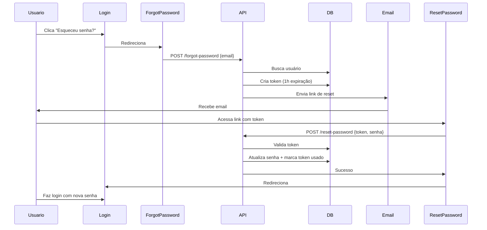

# Sistema de Recuperação de Senha

Implementação completa do fluxo de "Esqueceu a senha?" com tokens seguros e expiração.

## ✅ O que foi implementado

### 1. Banco de Dados
- **Tabela**: `password_reset_tokens`
- **Campos**:
  - `id`: ID autoincremental
  - `user_id`: Referência ao usuário
  - `token`: Token único (hash aleatório de 64 caracteres)
  - `expires_at`: Data de expiração (1 hora após criação)
  - `used`: Flag se o token já foi utilizado
  - `created_at`: Data de criação

### 2. APIs Criadas

#### [POST /api/auth/forgot-password](src/app/api/auth/forgot-password/route.ts)
- Recebe email do usuário
- Gera token aleatório único
- Salva token no banco com expiração de 1 hora
- Invalida tokens antigos do mesmo usuário
- Retorna sucesso mesmo se email não existir (segurança)
- Em desenvolvimento, retorna o link direto

#### [POST /api/auth/reset-password](src/app/api/auth/reset-password/route.ts)
- Recebe token e nova senha
- Valida:
  - Token existe
  - Token não foi usado
  - Token não expirou
  - Senha tem mínimo 6 caracteres
- Faz hash da nova senha com bcrypt
- Atualiza senha do usuário
- Marca token como usado

### 3. Páginas Criadas

#### [/forgot-password](src/app/forgot-password/page.tsx)
- Formulário com campo de email
- Validação com zod
- Em desenvolvimento, mostra link de reset direto
- Design consistente com página de login

#### [/reset-password/[token]](src/app/reset-password/[token]/page.tsx)
- Formulário com senha e confirmação
- Validação com zod (mínimo 6 caracteres)
- Verificação de senhas iguais
- Toggle para mostrar/ocultar senha
- Redireciona para login após sucesso

## 🚀 Como usar

### Passo 1: Executar Migration

**IMPORTANTE**: Pare o servidor dev antes de executar a migration.

```bash
# Parar servidor (Ctrl+C no terminal do npm run dev)

# Executar migration SQL
psql -U postgres -d organizador_juridico -f prisma/migrations/add_password_reset_tokens.sql

# Gerar cliente Prisma
npx prisma generate

# Reiniciar servidor
npm run dev
```

### Passo 2: Testar Fluxo

1. **Acessar tela de login**: http://localhost:3000/login
2. **Clicar em "Esqueceu sua senha?"**
3. **Digitar email cadastrado**
4. **Em desenvolvimento**: Copiar link do console ou da mensagem
5. **Acessar link de reset**
6. **Digitar nova senha** (mínimo 6 caracteres)
7. **Confirmar nova senha**
8. **Ser redirecionado para login**
9. **Fazer login com nova senha**

## 📧 Configuração de Email (Opcional)

Por enquanto, o sistema apenas loga o link de recuperação no console. Para enviar emails reais em produção:

### Opção 1: Resend (Recomendado)

```bash
npm install resend
```

```typescript
// src/app/api/auth/forgot-password/route.ts
import { Resend } from 'resend'

const resend = new Resend(process.env.RESEND_API_KEY)

await resend.emails.send({
  from: 'noreply@advconecta.com.br',
  to: email,
  subject: 'Recuperação de Senha - AdvConecta',
  html: `
    <h1>Recuperação de Senha</h1>
    <p>Olá ${name},</p>
    <p>Clique no link abaixo para redefinir sua senha:</p>
    <a href="${resetUrl}">${resetUrl}</a>
    <p>Este link expira em 1 hora.</p>
  `
})
```

### Opção 2: Nodemailer (SMTP)

```bash
npm install nodemailer @types/nodemailer
```

```typescript
import nodemailer from 'nodemailer'

const transporter = nodemailer.createTransport({
  host: process.env.SMTP_HOST,
  port: parseInt(process.env.SMTP_PORT || '587'),
  secure: false,
  auth: {
    user: process.env.SMTP_USER,
    pass: process.env.SMTP_PASS
  }
})

await transporter.sendMail({
  from: '"AdvConecta" <noreply@advconecta.com.br>',
  to: email,
  subject: 'Recuperação de Senha',
  html: `...`
})
```

### Variáveis de Ambiente

Adicionar em `.env`:

```env
# Resend
RESEND_API_KEY=re_...

# OU Nodemailer SMTP
SMTP_HOST=smtp.gmail.com
SMTP_PORT=587
SMTP_USER=seu@email.com
SMTP_PASS=sua_senha_app

# URL do app (produção)
NEXT_PUBLIC_APP_URL=https://app.advconecta.com.br
```

## 🔒 Segurança

### Implementado:
- ✅ Tokens aleatórios de 64 caracteres (crypto.randomBytes)
- ✅ Expiração de 1 hora
- ✅ Token usado apenas uma vez
- ✅ Hash bcrypt para senhas (custo 10)
- ✅ Não revela se email existe no sistema
- ✅ Invalidação de tokens antigos ao solicitar novo

### Recomendações adicionais:
- [ ] Rate limiting na API (ex: 3 tentativas por hora por IP)
- [ ] CAPTCHA na página de forgot-password (opcional)
- [ ] Log de tentativas de reset para auditoria
- [ ] Email de notificação quando senha for alterada

## 📋 Fluxo Completo



## 🧪 Testes Manuais

### Teste 1: Email Existente
1. Acessar `/forgot-password`
2. Digitar email cadastrado
3. Verificar mensagem de sucesso
4. Verificar token no console (dev) ou email (prod)
5. Acessar link de reset
6. Redefinir senha
7. Fazer login com nova senha

### Teste 2: Email Inexistente
1. Digitar email não cadastrado
2. Verificar mensagem genérica de sucesso (não revela inexistência)
3. Verificar console - não deve criar token

### Teste 3: Token Expirado
1. Criar token manualmente no banco com `expires_at` no passado
2. Tentar usar o link
3. Verificar mensagem de token expirado

### Teste 4: Token Já Usado
1. Usar um token válido
2. Tentar usar o mesmo token novamente
3. Verificar mensagem de token já utilizado

### Teste 5: Senha Fraca
1. Tentar definir senha com menos de 6 caracteres
2. Verificar validação no front e no back

## 📝 Arquivos Modificados/Criados

### Banco de Dados
- `prisma/schema.prisma` - Adicionado model PasswordResetToken
- `prisma/migrations/add_password_reset_tokens.sql` - Migration SQL

### APIs
- `src/app/api/auth/forgot-password/route.ts` - Gerar token
- `src/app/api/auth/reset-password/route.ts` - Validar token e alterar senha

### Páginas
- `src/app/forgot-password/page.tsx` - Solicitar reset
- `src/app/reset-password/[token]/page.tsx` - Redefinir senha

### Já Existia
- `src/app/login/page.tsx:184` - Link "Esqueceu sua senha?" já estava implementado

## 💡 Melhorias Futuras

- [ ] Template de email HTML responsivo
- [ ] Tradução i18n
- [ ] Histórico de mudanças de senha
- [ ] Exigir senha forte (maiúscula, número, símbolo)
- [ ] MFA (autenticação de dois fatores)
- [ ] Recuperação por SMS
- [ ] Perguntas de segurança

---

**Status**: ✅ Implementação completa
**Data**: 2025-01-19
**Versão**: 1.0
